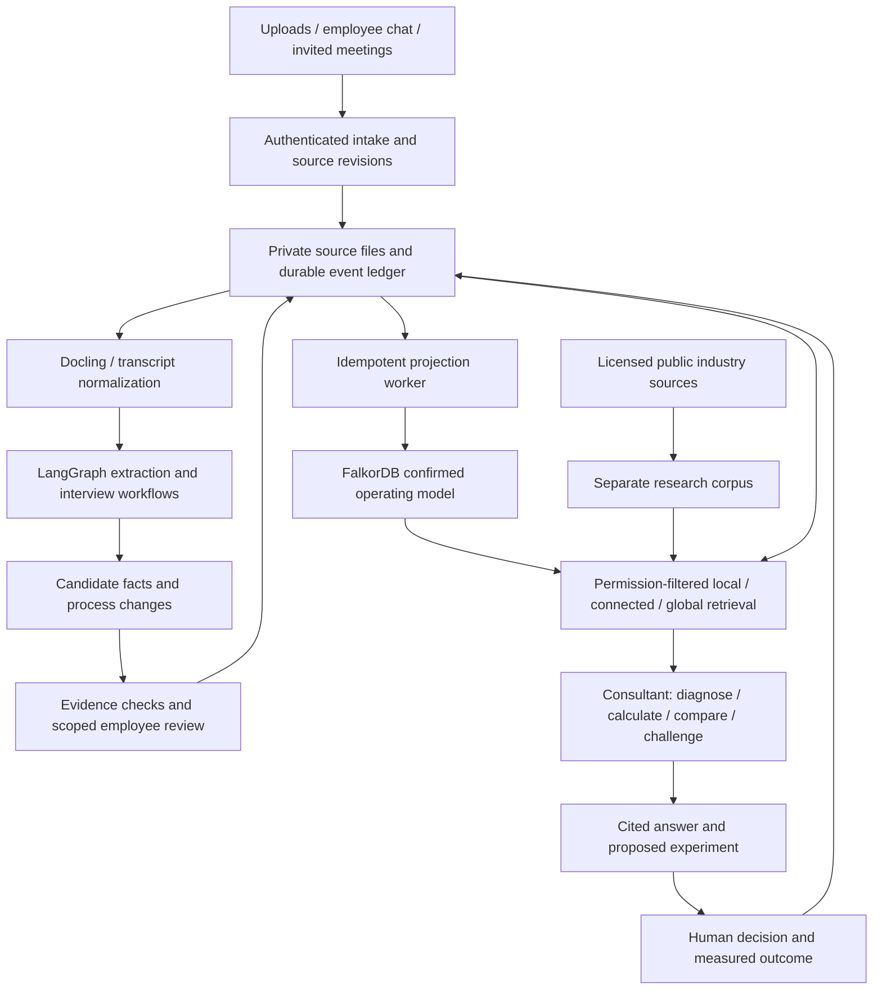

# Oracle overhaul: a company consultant that learns from evidence

Written 2026-09-27 EDT. Plan owner: Oracle implementation lead, assigned through [parent issue #24](https://github.com/u2giants/theoracle/issues/24). Research and source inspection baseline: `b3f2377f9b1fd13e1b9abf07cc8f342c180f076e` on `u2giants/theoracle/main`.

**Planning complete; implementation is in progress.** S01 is accepted offline and S02 is accepted on synthetic evidence; see STATUS below. This document specifies the replacement but does not attest that the whole replacement works or authorize production changes. The current application continues to operate under its existing controls until an accepted replacement exists.

## STATUS — read this first

S01 has an offline record. S02 is accepted on synthetic offline, preview, model and license evidence as of 2026-09-28 EDT. S03 code is on `main` (`1cdca59`, PR #57) with the synthetic offline gate green in CI; the real-data preview with Ilona remains open (#58 / #27). Later stages remain open. An issue is an owner/discussion pointer, not acceptance evidence. A completed row must link a reproducible result artifact and deployed revision when relevant.

| Step | Outcome | Status | Dependency | Evidence / owner |
|---|---|---|---|---|
| S01 | Acceptance corpus and baseline availability | ✅ offline accepted; live comparison unavailable | None | [S01 record](docs/verification/oracle2/S01-baseline.md), [synthetic manifest](evals/oracle2/synthetic-cases.jsonl); [child #25](https://github.com/u2giants/theoracle/issues/25). No real-quality claim. |
| S02 | Isolated foundation and database/library qualification | ✅ accepted (synthetic only) | S01 | [S02 record](docs/verification/oracle2/S02-dependencies.md) incl. Trigger preview runs on CPython 3.12.14, [models](docs/verification/oracle2/S02-models.md), [FalkorDB license fit](docs/verification/oracle2/S02-falkordb-license.md); [offline CI run 36450899266](https://github.com/u2giants/theoracle/actions/runs/36450899266) at `da76d0a` (final code; later commits documentation-only), [PR #45](https://github.com/u2giants/theoracle/pull/45), [child #26](https://github.com/u2giants/theoracle/issues/26). No business-quality or real-data claim. |
| S03 | One usable document-to-consultation journey | 🔵 merged to main — offline gate green; real-data preview unproved | S02 | [PR #57](https://github.com/u2giants/theoracle/pull/57) **MERGED** as `1cdca59` (2026-09-29 7:19 PM EDT); offline gate `verify_phase.py S03 --mode offline` 11/11 in CI run `36644212614`; browser test `tests/oracle2/pilot.spec.ts` covers upload → correction → confirmation → answer after page refresh (needs a running web server; not in offline CI); [child #27](https://github.com/u2giants/theoracle/issues/27) open; [leftover-proof #58](https://github.com/u2giants/theoracle/issues/58) for real-data preview with Ilona. No business-quality or real-data claim. |
| S04 | Reliable document learning, revisions and withdrawal | ⬜ open | S03 | Not built; [child #28](https://github.com/u2giants/theoracle/issues/28) |
| S05 | Confirmed temporal operating model and corrections | ⬜ open | S04 | Not built; [child #29](https://github.com/u2giants/theoracle/issues/29) |
| S06 | Resumable employee interviews and ordinary chat learning | ⬜ open | S05 | Not built; [child #30](https://github.com/u2giants/theoracle/issues/30) |
| S07 | Learning from explicitly invited Teams meetings | ⬜ open | S06 | Not built; [child #31](https://github.com/u2giants/theoracle/issues/31) |
| S08 | Bounded in-meeting questions and answers | ⬜ open | S07 | Not built; [child #32](https://github.com/u2giants/theoracle/issues/32) |
| S09 | Connected and company-wide answers | ⬜ open | S05, S08 | Not built; [child #33](https://github.com/u2giants/theoracle/issues/33) |
| S10 | Maintained industry expertise with applicability checks | ⬜ open | S09 | Not built; [child #34](https://github.com/u2giants/theoracle/issues/34) |
| S11 | Evidence-based advice and measured improvement experiments | ⬜ open | S10 | Not built; [child #35](https://github.com/u2giants/theoracle/issues/35) |
| S12 | Complete employee and executive workspace | ⬜ open | S11 | Not built; [child #36](https://github.com/u2giants/theoracle/issues/36) |
| S13 | Recovery and operational readiness | ⬜ open | S12 | Not proven; [child #37](https://github.com/u2giants/theoracle/issues/37) |
| S14 | Historical knowledge migration and comparison | ⬜ open | S13 | Not run; [child #38](https://github.com/u2giants/theoracle/issues/38) |
| S15 | Controlled production adoption | ⬜ open | S14 | Not released; [child #39](https://github.com/u2giants/theoracle/issues/39) |
| S16 | Legacy retirement with recoverable history | ⬜ open | S15 | Not started; [child #40](https://github.com/u2giants/theoracle/issues/40) |

**Next session starts at the S03 real-data preview proof** (#58 under #27), not at a database migration, an old R2 experiment, or S04. Do not name S04 as next until S03 is fully accepted. Read this whole plan, then take the first unticked child on #24. Do only that child; update this STATUS, comment the next child, and stop. All later stages remain in scope for the program, but not for that session. At each natural cut point, apply `fresh-session` and re-read every downstream stage to plan-end for changed assumptions. Record drift before handing over. No floating set of partially proved releases.

Research: [technology and strategy review](docs/research/oracle-consultant-technology-review.md). S01: [acceptance specification](evals/oracle2/acceptance-spec.md) and [verification record](docs/verification/oracle2/S01-baseline.md). Planning [handoff](HANDOFF.d/2026-09-28T0044Z-edge-dev3-codex-oracle-consultant-overhaul.md) remains until its header records committed and pushed status under the successor rule. This plan and those records are the current brief; the planning chat is not required.

## 1. Ultimate goal

Give Albert and his employees a knowledgeable operating adviser that understands how this particular company makes money, how work really flows, where exceptions and dependencies matter, and which changes are worth trying. It continually learns from material the company supplies, meetings it is invited to, and conversations employees choose to have with it. It can explain a procedure, find a bottleneck, compare alternatives, and recommend a practical improvement with evidence and a way to measure the result.

**If a step conflicts with this goal, the goal wins — stop and flag it.** Do not trade away privacy, evidence integrity or recoverability to meet a metric. Escalate the conflicting step on the parent and propose a concrete correction.

“McKinsey-in-a-box” is the owner's description of ambition, not a claim of affiliation or a guarantee of expert judgement. Success is useful, company-specific, accountable advice. A beautiful graph, a library integration, a fluent answer or a large number of stored claims does not establish success.

The finished product must answer, with the applicable date and evidence: what happens, who does it, why, what can go wrong, what differs by customer/product/licensor, what changed, and what we should investigate or improve. It must distinguish official policy, observed practice, employee reports, unresolved disagreements, outside research, inference and recommended action.

Initial first-value scenario: supply an authorized document describing a cross-department product approval flow; correct the map in the interface; ask where a handoff can fail; receive an answer citing the actual steps and exceptions, plus one explicitly hypothetical improvement experiment. This must exist by S03. It must not wait for every connector, every industry source or an entire historical backfill.

## 2. What this application is

Oracle is the POP Creations / Spruce Line company knowledge application. The repository describes a home-decor business. Existing fixtures also address licensed-product workflows and overseas responsibilities. Treat the exact sub-industry profile as evidence to establish in S01/S06, not as permission to invent products, agreements, employee roles or company economics.

- Public source repository: [u2giants/theoracle](https://github.com/u2giants/theoracle). Public visibility was verified during planning. No private transcripts, contracts, customer records or business answer keys may be committed or posted to issues.
- Existing employee site: `https://oracle.designflow.app`, hosted on Vercel. Existing workers: Trigger.dev. Existing database/auth/file storage: the dedicated Oracle Supabase project documented in `docs/1password.md`; it is distinct from the shared POP application database.
- Current code: TypeScript pnpm monorepo, Next.js web app, direct model-provider adapters, Postgres/pgvector, Drizzle data definitions. `apps/workers/package.json:8` and `:37` pin Trigger.dev CLI/SDK 4.5.15; older architecture prose calling the runtime v3 is stale.
- Existing repository components: `apps/web` (interface/API), `apps/workers` (jobs), `packages/ai` (generation/retrieval), `packages/db` (database), `packages/oracle-engines` (validation), `packages/auth` (identity), `packages/shared` (shared contracts).
- Planned replacement core: `services/oracle-brain` (Python package, not necessarily an HTTP service), driven by thin Trigger tasks. Existing web/auth are reused only where their behavior passes the replacement tests. Company evidence lives in private object storage; canonical acceptance events and workflow state live in Oracle Postgres; FalkorDB serves derived knowledge.

Local planning checkout was `/home/ahazan/repos/oracle-consultant-overhaul`, isolated from `/home/ahazan/repos/oracle`. Future sessions create their own current-upstream worktree. Paths in §9 are stage deliverables; use the STATUS table and current tree to determine which ones now exist.

## 3. Trigger and authority

On 2026-09-27 EDT Albert said seven months of work had not produced the needed result and asked for a complete overhaul without sacred cows. He then explicitly requested this researched implementation plan for a high-level consultant that learns through documents, invited Teams meetings, and employee interviews/chat.

This is product redesign planning, not a fresh reproduction of a single bug. Planning inspected source and historical evidence; it did not sign into production or assess employee use live. Do not claim the whole existing application is broken or worthless from this inspection. The verified concern is the mismatch between the requested business outcome and incomplete, historically fragile comprehension/consulting flows.

Publishing this plan sets the forward design for the **new isolated consultant path**. Historical plans remain evidence and govern any work on the old runtime. This plan does not silently resume an old production experiment, override a stopped live gate, close another owner's issue, or approve a vendor purchase. Old R2 and Jev plans are not prerequisite implementation roadmaps for the new isolated path. Their still-applicable safety/data restrictions remain in force.

## 4. Scope

### In

Connected, dated company knowledge; sources with exact citations; document/image/table reading; conversational interviews; passive learning from normal chat with visible confirmation; invited meeting capture and bounded participation; company-wide retrieval; maintained sector research; consultant diagnosis and recommendations; numerical scenario calculations from supplied measurements; feedback and experiment outcomes; English and Simplified Chinese input/serving; permissions; exports; evidence deletion/correction; migration and retirement; economical operation.

### NOT in this plan

Autonomous purchases, contracts, pricing updates, ERP/PLM writes, emails or uninvited employee outreach; covert meeting capture; personnel scoring; legal/regulatory determinations; a custom foundation model; general-purpose autonomous agent swarms; a new identity provider; replacing all business applications; mandatory real-time voice; unrestricted web scraping; buying research subscriptions; importing licensed datasets into public code; training model weights on employee conversations; a universal ontology for all industries; a second task-management product.

Read-only operational exports for cycle-time/volume analysis are in S11. A new live ERP connector or any change to another app/database requires its own bounded issue and permission contract. Until data exists, advice must show missing measurements and cannot assert ROI.

## 5. Current code and evidence

All references in this section resolve at the baseline SHA above; line numbers can move. Use the named symbol as well as the line. Historical scores are quoted as recorded history, not revalidated production results.

| Component | Evidence | What is true / implication |
|---|---|---|
| Interview behavior | `packages/ai/src/prompts/oracle-system.ts:7`, investigative tactics at `:22` | Prompt already asks about workarounds, dependencies and disagreements. “Add an interviewer prompt” is not a new solution |
| Current retrieval | `packages/ai/src/retrieval.ts:277` `searchWithRetrievalPlan`; `:526` `getEligibleRelationshipClaims` | Existing text/vector and approved-relationship retrieval should be measured as a baseline |
| Current answer integrity | `apps/web/lib/business-answer-reconciliation.ts:12`, `:56`, `:97`; `apps/web/app/api/chat/route.ts:307` | Strict reconciliation, canonical evidence rendering and independent semantic review exist. Valid schema/citation identity still does not guarantee useful business understanding |
| Relational business model | `packages/db/src/schema.ts:772` processes, `:794` objects, `:816` versions, `:842` elements, `:875` relations | There is already a model of connected business objects; no basis for saying a graph database is the missing feature by itself |
| Shadow model | `apps/workers/src/lib/business-model-merge.ts` `createResponsibilityShadowProposal` (locate with `rg`) | Implementation explicitly requires merge enabled and apply disabled. Do not promote shadow proposals merely because a replacement needs examples |
| Document ingestion | `apps/workers/src/trigger/document-ingestion.ts:186` `chunkTextStructured` | Structure-aware text chunking already exists; prove layout/cell/region fidelity beyond text boundaries in the replacement |
| Synthesis | `apps/workers/src/trigger/brain-synthesis.ts:242` `synthesizeSection`, `:686` task | Brain sections already exist; the new design needs source-dependent revision and actionable diagnosis, not a renamed summarizer |
| Teams post-meeting path | `apps/workers/src/trigger/teams-transcript-ingestion.ts:78` | Existing ingestion is reusable only after invitation, attribution, revision and permission tests |
| Recall ingress | `apps/web/app/api/teams/live/recall/route.ts:15`, signature check `:24` | Webhook already verifies and delegates; keep that boundary and replace downstream learning deliberately |
| Recorded regression | `HANDOFF.d/2026-08-27T1600Z-al8960ofc-claude-r2-reason-feedback-regressed.md:1`, `:44` | Historical prompt change regressed a 30-item gate; a rollback restored the prior map. Do not optimize by unmeasured prompt accumulation |
| Connected-answer proof | `HANDOFF.d/2026-09-22T2033Z-916-codex-live-proof-interrupted.md:56`, `:72`, `:80` | Released code was recorded; full live acceptance remained incomplete. Issue #15 is currently open |
| Jev | `HANDOFF.d/2026-09-20T1411Z-916-codex-jev-integration-plan.md:48` | Planning only; no implementation proof. Issue #14 remains open and is not a dependency for this redesign |
| Build/test entry points | `package.json:6`, `docs/development.md:40`, package manifests | Existing verification scripts are real; proposed oracle2 scripts below are not yet implemented |

The old macro plan's top banner records an earlier 19/30 stop, while later handoffs record changed results and a restoration. Do not present the banner as today's complete truth, compare different matchers as one score, or rerun historical paid gates under this plan. S01 obtains a read-only current baseline or records that it is unavailable; the new held-out corpus is separate.

## 6. Findings and diagnosis

### Established from source/history

1. The desired process-centric direction was already described in the old macro plan (§1). The missing result cannot be explained solely by lack of intent or lack of a graph-shaped schema.
2. Source extraction, evidence validation, retrieval, final explanation and business usefulness are separate failure surfaces. Existing strict reconciliation contracts and the recorded ungraded live answer show why passing local guards is insufficient.
3. Some documentation is stale relative to code (Trigger version and historical macro status). Fresh implementation must reconcile artifacts with deployed state and avoid compounding stale assumptions.
4. Existing inference integrations are numerous. Adding Jev, several memory libraries and another routing platform together would increase moving parts before showing value.

### Design inference, to test rather than declare proven

The replacement should make a **versioned operating model** the main unit: process, responsibility, rule, exception, decision, measured issue and intervention. Each unit keeps source receipts. Smaller claims support that model but are not the employee experience. A bounded graph-backed trial can establish whether this improves connected answers over current retrieval and long-context source reading. It will not prove that FalkorDB itself produces better reasoning.

The consultant also needs a maintained industry reference layer, explicit competing explanations, numerical tools and outcome feedback. Those are product capabilities, not features supplied automatically by a graph store. This is the main expansion beyond the earlier five-component proposal.

## 7. Rejected approaches and known dead ends

| Approach | Why rejected / evidence | Replacement |
|---|---|---|
| Another prompt-only repair as the overhaul | Historical R2 regression and incomplete live acceptance; a local score can improve while real use worsens | Freeze held-out end-to-end journeys and compare controlled versions |
| Rebuild every component before an employee can use it | Repeats the long delay to business value | S03 usable thin journey; expand only after evidence |
| FalkorDB as the only store for users, files, conversations and approved knowledge | Couples graph experiments to all durable application state | Postgres evidence/events/checkpoints, private file store, rebuildable graph |
| Graphiti output immediately becomes company policy | Model-generated extraction/invalidations do not establish authority or scope | Isolated candidates, explicit admission and scoped confirmation |
| Filled schema means true or complete | Missing exceptions, conflicting evidence, invalid chronology can all produce valid JSON | Evidence, applicability and contradiction checks plus process-owner review |
| Jev decides missing required fields or authorization | Deterministic checks are simpler; probabilities do not authorize a fact | Ordinary checks; optional Jev only after measured value and its existing data gates |
| Automatically replace older facts with newer text | A newer statement can be tentative, wrong, customer-specific or future-dated | Preserve scope, valid time, observed time, opposition and reviewer decision |
| Free-form generated Cypher for employees | Unbounded queries, writes, scope leaks and misleading path semantics | Typed bounded read templates |
| One vector hit followed by a neighborhood walk | Misses alternate names, distant departments and company-wide themes | Hybrid retrieval and a separate global-summary path |
| Multiple canonical memory products at once | Different deduplication, approval and deletion semantics | One evidence authority; one selected graph adapter |
| Adopt archived Open Deep Research as the maintained base | Archive state verified in research | Small owned research workflow; reuse ideas and licensed components only |
| Publish private fixtures to reproduce quality | Repository is public | Public synthetic fixtures, private ground truth in approved storage |
| Permanent custom fork of Graphiti/Docling | Creates another maintenance product | Small adapter, bounded fallback, upstream reproducer if justified |
| Treat correlation or a knowledge edge as causation | Neither proves a business intervention will work | Explicit hypothesis, alternative explanations and measured experiment |
| Automatic fine-tuning on uploads | Hard to retract and unnecessary for initial learning | Versioned retrieval memory; optional offline optimization later |

## 8. Design decisions and build contracts

Decisions below are dated 2026-09-27 EDT. “Locked” means the implementing session follows this plan; it does not override a higher-priority owner instruction or a failed mandatory test.

### 8.1 Decisions

| Decision | State | Reason / condition |
|---|---|---|
| Evidence ledger is durable authority; graph is derived | Locked | Rebuilds and library changes must not erase accepted knowledge |
| FalkorDB first; Neo4j sole graph fallback | Conditional selection | S02 proof and deployment-license fit; no production assumption from a demo |
| Graphiti adapter for candidate extraction/search | Conditional selection | Exact provenance, isolation and controlled invalidation must pass; bounded fallback is structured extraction into the same contracts |
| Python 3.12 core, Pydantic models, Python LangGraph | Locked for first slice | Fits selected libraries; no port to JS merely to preserve old code |
| Trigger.dev Python extension as first execution host | Conditional selection | Prove dependency packaging, cold start, cancellation and pause/resume at pinned versions in S02 |
| Next.js shell, current identity, current private storage | Conditional reuse | Preserve only after permission/usability tests; no new auth migration in this program |
| Postgres LangGraph checkpointer | Locked for first slice | Conversation continuity independent of graph projection lifecycle |
| One primary generation model and one evaluated fallback | Locked shape; model IDs resolved in S02 | Current supported models, fixed versions, same task corpus; no assumption that a retired model exists |
| No Jev dependency in first usable release | Locked | S01–S03 can run without a new decision service |
| Model learns through evidence updates | Locked | No silent online training or self-approval |
| Human confirmation required for normative policy/ownership changes | Locked | An interviewee can confirm their report, not silently redefine another role's authority |
| Quantitative conclusions require measurements | Locked | Otherwise show scenarios and missing data, never invented savings |
| Production rollout and spending | Open only at the relevant implementation gate | Planning does not authorize paid accounts, purchases or production infrastructure changes |

### 8.2 Architecture and authority



Only accepted events in C authorize H to update the **confirmed** graph. Extraction and projection run in separate deployments with distinct runtime identities and secret scopes. Extraction has candidate-write access only; projection has confirmed-write access and consumes accepted ledger events, never arbitrary model instructions. No process or deployment receives both graph write credentials. The confirmed writer rejects events lacking a valid accepted-ledger receipt. Model code has candidate-write access only. Do not allow an extraction library to share a write credential with the confirmed projection. Model calls receive a permitted evidence pack, not a general database credential. The UI and MCP use the same retrieval gateway. A transaction/outbox joins accepted state and projection work; graph writes are at-least-once, idempotent and replayable. No distributed “exactly once” claim.

Initial physical layout: Oracle Postgres schema `oracle2` for new application tables, separate from current tables; object prefix `oracle2/` in private storage; distinct candidate and confirmed graph namespaces per workspace/access partition. This is a proposal, not deployed structure. No writes to the shared POP database are needed for initial scope. If future structural work targets that database, route it through `popcre/shared-db` before application changes (§11).

### 8.3 Business model and evidence

Use stable UUIDs and explicit types, not sentence strings as identity. Start with `Organization`, `Department`, `Role`, `PersonRef`, `Process`, `Step`, `System`, `Artifact`, `ProductClass`, `CustomerRef`, `VendorRef`, `LicensorRef`, `Rule`, `Exception`, `Decision`, `Issue`, `MetricDefinition`, `Observation`, `Recommendation`, `Experiment`. Link types include `PART_OF`, `PRECEDES`, `PERFORMED_BY`, `APPROVED_BY`, `USES`, `PRODUCES`, `DEPENDS_ON`, `APPLIES_TO`, `EXCEPT_WHEN`, `SUPPORTS`, `CONTRADICTS`, `SUPERSEDES`, `MEASURED_BY`. A relation must have a type, scope and support; a line between two nodes is not evidence of causality.

Application tables to introduce in the dedicated Oracle schema: `source`, `source_revision`, `source_span`, `access_policy`, `knowledge_event`, `assertion`, `assertion_support`, `entity_identity`, `review_bundle`, `review_decision`, `authority_grant`, `authority_event`, `projection_outbox`, `projection_receipt`, `workflow_run`, `interview_session`, `meeting_capture`, `research_source`, `recommendation`, `experiment`, `metric_observation`, `evaluation_run`. DDL belongs to the correctly classified database owner; this list is a proposed contract, not permission to apply it.

Minimum contract fields:

| Contract | Required content |
|---|---|
| SourceRevision | workspace, source ID, immutable revision/hash, source kind, language, owner, collection permission, access-policy version, capture time, asserted effective date when known, parser/model version, private blob reference, processing status |
| SourceSpan | revision ID; original page/region, cell/range, or transcript turn/time; source text hash; normalized-text mapping; OCR/attribution uncertainty; no invented exact quote |
| Assertion | stable ID, subject/predicate/object or typed value, scope (workspace/customer/product/region/process), assertion kind, valid-from/to, recorded-at, optional superseded-at, source supports/opposition, confirmation state, accepting actor, revision |
| ChangeBundle | expected current version, proposed additions/retirements/merges, affected process IDs, reasons, unresolved conflicts, evidence; optimistic concurrency token |
| Recommendation | problem, evidence IDs, competing explanations, applicability, alternatives including no change, expected benefit range or unknown, calculation inputs/units, effort/risk, owner role, reversible experiment, success metric, review date, status |
| EvaluationRun | app/model/parser/embedding/graph versions, fixture manifest hash, permitted corpus version, measurements, costs, failures, human rubric and result artifact reference |

Use `valid_from/to` for when the business statement applies and `recorded_at` for when Oracle learned it. Unknown dates stay unknown; do not make upload time the effective date. `observed`, `reported`, `proposed`, `confirmed`, `disputed`, `superseded`, `withdrawn` are distinct. Confirmation never broadens source permissions. Multiple sources with the same origin are not independent corroboration. Person aliases are workspace-scoped; shared names do not imply shared identity. Numeric facts carry currency, units, period, population and source.

Approval authority is durable application data. `authority_grant` records workspace, stable actor ID, permitted action/assertion kinds, process/customer/region scope, validity interval, grantor, delegation parent, maximum delegation depth and revocation version. Root grants require a recorded appointment by Albert or an already owner-appointed organizational authority, bound to verified actor identity, workspace, scope and effective dates. An administrator may provision that appointment but cannot create its business authority or self-appoint. The bootstrap operation validates the appointment record against the independently authenticated owner instruction; absent evidence, confirmation stays disabled and synthetic work continues. Subsequent root appointments use the same procedure; employee claims, job titles, imported documents and models cannot grant authority. Delegation cannot broaden the parent's scope or lifetime. Revoking a parent revokes its descendants. Acceptance checks the live grant chain and current membership in the same transaction as the review decision, recording grant/version evidence. Revocation prevents pending or replayed approvals; previously accepted decisions retain their historical authority record and become review-required when the revocation explicitly challenges those decisions. Historical validity does not confer current authority.

### 8.4 Continuous learning without uncontrolled changes

1. Admit and fingerprint an authorized source revision; duplicate delivery acknowledges the existing ID.
2. Normalize structure and extract candidates with traceable source spans.
3. Resolve identity conservatively. Exact stable IDs win; ambiguous matches produce a review question.
4. Compare candidate scope/time to existing assertions. Keep alternatives and contradictions; don't overwrite.
5. Admit observational reports as visibly reported evidence. Policy, responsibility, access and financial-rule changes require a scoped process-owner confirmation bundle. Batch related facts so employees approve a coherent change, not hundreds of individual claims.
6. Commit accepted events and outbox atomically. Project the new graph revision and invalidate affected summaries/recommendations/caches.
7. Retrieve only admissible facts for the requested mode. Company-policy answers require confirmed facts; “what was reported in that meeting?” may use reported evidence with its label and access restrictions.
8. On source withdrawal/revocation, immediately block serving affected material through the gateway, then remove derived copies/checkpoints/caches according to retention rules and rebuild support. An assertion with independent remaining support can survive without the withdrawn quote. Never silently erase conflict history except where deletion policy requires it.

Workers process an idempotency key `(workspace, source_id, revision_hash, pipeline_version, stage)` with a durable lease. Only the current lease generation may publish a result. Retries cannot duplicate knowledge or meeting messages. Queue retries use a bounded backoff; exhausted tasks appear in Sources with a recover/retry action. Reprocessing uses a new derived revision and compares before replacing the serving pointer.

### 8.5 Interfaces and permissions

Pydantic models in `services/oracle-brain/oracle_brain/contracts.py` are the canonical new contracts. Export JSON Schema to `packages/brain-contracts/schema/`; generate TypeScript types and validate incoming/outgoing JSON with Ajv. Existing Zod paths remain until retired. A contract parity test forbids separately edited TS/Python business semantics.

Python entry point `python -m oracle_brain.cli` accepts validated JSON on stdin and emits a single structured result; diagnostics go to redacted stderr. Durable progress is stored under `workflow_run`, not parsed from prose logs. Worker arguments contain opaque run IDs, not source text or credentials. No pickle/object deserialization from caller-controlled checkpoints.

New web routes: `POST /api/consultant/sources`, `POST /api/consultant/interviews`, `POST /api/consultant/interviews/[id]/turns`, `POST /api/consultant/questions`, `POST /api/consultant/reviews/[id]`, `GET /api/consultant/runs/[id]`, `POST /api/consultant/meetings`, `GET /api/consultant/processes/[id]`, `GET /api/consultant/recommendations`, `POST /api/consultant/experiments/[id]/observations`. Names are implementation targets. Every route resolves workspace and actor server-side, rechecks membership, enforces CSRF/session protection as applicable, and scopes object lookup. Client-supplied workspace/group IDs cannot confer access.

A permission-filtered query resolves accessible source/assertion IDs before packing text into a model call and before expanding graph edges. Derived summaries use the intersection of their supporting permissions; do not summarize restricted facts into a general company overview. Cache keys include principal/access-policy version, source revision and query mode. Revocation increments the policy version; old cache entries/checkpoint replay cannot bypass it. Direct graph endpoints are never browser-accessible. “Zero evidence” gives an honest gap response, not guessed policy.

### 8.6 Interview and consultant behavior

Interview state includes confirmed identity/scope, source evidence IDs, draft process, unresolved fields/conflicts, asked questions, corrections, deferred items, pause state and schema version. Ask one question at a time, prioritizing missing handoffs, exceptions, decision criteria and conflicting accounts. Start with a concrete recent example; walk trigger → steps → handoffs → result, then explore failures and variations. Answer an employee's direct question before returning to the interview. Allow “I don't know,” skipping, stopping and referral to another role without automatically contacting them. Default ten-minute session target; stop after eight substantive questions or employee request and show a draft recap. Resuming after days must not repeat answered questions or lose a correction.

Consulting workflow: clarify decision → gather permitted company evidence → consult applicable industry references → construct competing explanations → run deterministic calculations → compare alternatives → challenge unsupported statements → present a concise recommendation plus evidence/assumptions → record human decision → track the proposed experiment. A separate challenge call is justified for an executive recommendation, not a costly multi-agent debate for every greeting. Maximum one repair of a rejected recommendation, then show bounded findings and remaining evidence needs.

### 8.7 Proposed performance and cost limits

All figures here are **initial engineering targets**, not current measurements, prices or spending authority. S01 may tighten them with the business task; changes must be documented, never made just to pass.

- Ten concurrent pilot users; warm graph retrieval p95 <= 2 seconds; ordinary answer p95 <= 20 seconds; interview turn p95 <= 12 seconds. Long reports are asynchronous with visible progress and cancellation.
- Standard 20-page document processed p95 <= 5 minutes on the qualified host; a finished 60-minute transcript becomes a reviewable bundle <= 10 minutes after the provider makes it available. Large/OCR-heavy files show a size-specific estimate instead of pretending to meet the small-file target.
- Initial hard run ceilings: ordinary answer 4 model calls / 30,000 input tokens; interview turn 2 calls / 15,000 tokens; consultant report 12 calls / 120,000 tokens; document job 20 calls / 200,000 tokens. Track actual cost from the selected provider's current published rates. Per-workspace daily caps are configurable and mandatory before paid pilots; no dollar amount in this plan authorizes spend.
- Pilot permissions/evidence/withdrawal failures: zero tolerated. Quality thresholds are in §10. Require rates by question category, not a flattering combined average.
- Report draft savings only as scenarios. Example calculations use synthetic labels and stated assumptions; observed outcomes require dated measurements and denominators.

## 9. Ordered implementation steps

### Common execution contract

Each step is a separate child under #24 and a natural context cut point. The parent imposes serial execution even where technical work could be parallel. Dependencies below describe technical prerequisites; they do not authorize concurrent sessions against the same outcome. Within a child, independent read-only investigation or isolated tests may run together. The child assignee owns the outcome through live proof or one explicitly owned leftover-proof issue. Never equate code merged with accepted behavior.

Each step must: resolve current upstream; read its entry files; declare the task class; implement only its specified outcome in an isolated worktree; run its tests and applicable retained guards; obtain required review; land through PR; prove the named environment outcome; update STATUS with actual artifacts; re-read all downstream stages and record drift; identify the next child and stop. If code lands without its one live outcome, create that exact proof-owner issue immediately and leave the child open. An offline foundation step has no invented live gate.

S01 creates the manifest validator. S02 creates `scripts/oracle2/verify_phase.py`; it maps a phase to its explicitly listed tests and report schema and exits nonzero for missing/skipped required evidence. Commands below are **future deliverables**, not existing scripts. `--mode offline` cannot set `live_accepted=true`; `--mode live --manifest PRIVATE_PATH` requires the reviewed target and writes evidence only to approved private storage. A sanitized result records hashes, versions, pass/fail and approved artifact pointers, never source text. Implementation documentation must include exact commands to reproduce each result.

### S01 — Establish the business acceptance set and baseline

**Change:** create `evals/oracle2/acceptance-spec.md`, `evals/oracle2/synthetic-cases.jsonl`, `evals/oracle2/manifest.schema.json`, `scripts/oracle2/validate_manifest.py`, and `docs/oracle2-baseline.md`. Read the current retrieval/reconciliation files in §5 and existing `apps/web/lib/__verify__/business-answer-journey.ts`; do not change runtime logic.

**Behavior:** define 20 held-out acceptance questions across procedure/ownership (4), conditional exceptions (4), cross-department dependencies (4), historical changes/disagreement (3), and improvement decisions (5). Examples must include a changed reorder, ambiguous approval ownership, a source correction, insufficient evidence, and an unrelated-topic switch. For every case record required facts, forbidden inferences, evidence spans, time/scope, answerable/abstain expectation and reviewer rubric. Add 12 source-format/adversarial fixtures separately. Create a separate development set of 10 questions, two per category: 30 business questions total. Keep all 20 acceptance cases held out, including all five improvement cases. Separate the sets by source/process, not random near-duplicate sentences. The manifest stores split and category and validates these exact counts. Public fixtures are invented; real equivalents stay private.

Measure current Oracle on authorized material and a direct long-context baseline using identical sources and permissions. A unavailable live baseline is explicitly unavailable, never zero and never a reason to block building a synthetic harness. Do not send production test messages without the exact authorized test flow. Process owners verify real answer keys before a business-quality claim; synthetic success alone cannot pass S03's real-data gate.

**Depends:** none. Manifest and safe fixture authoring can proceed without credentials. **Gate:** `python3 scripts/oracle2/validate_manifest.py --synthetic` rejects absent evidence and split leakage; 20 held-out plus 10 development cases and 12 adversarial source fixtures are manifest-valid; private real-data manifest location and review owner are recorded. Completion artifact: `docs/verification/oracle2/S01-baseline.md` with versions, availability and measured results, not invented numbers.

### S02 — Build and qualify the isolated foundation

**Change:** add `services/oracle-brain/{pyproject.toml,uv.lock,README.md}`, `oracle_brain/{contracts.py,config.py,cli.py,models.py,storage.py,authz.py,outbox.py}`, `oracle_brain/graph/{base.py,falkor.py,graphiti_candidates.py}`, `oracle_brain/{provider_policy.py,projector_cli.py}`, `dev/oracle2/runtime-identities.yaml`, `.github/workflows/oracle2-contracts.yml`, `packages/brain-contracts/{package.json,schema/,src/}`, `scripts/oracle2/{verify_phase.py,export_contracts.py}`, and `dev/oracle2/compose.yaml`. Pin images by digest and lock Python dependencies. Update `apps/workers/trigger.config.ts` and package manifest for the qualified Python extension; add `apps/workers/src/trigger/oracle2-run.ts` as a thin transport, plus `apps/workers/src/trigger/oracle2-project.ts` deployed under the separate projector identity. If the host cannot isolate secrets between deployments, use separately scoped Trigger projects or the already bounded container-host qualification; sharing a credential-bearing runtime fails S02. Add correctly owned additive Oracle schema migrations only after target classification (§11); no production apply in this child.

**Behavior:** boot local isolated Postgres, FalkorDB and object-store test storage; synthetic-only by default; disable graph library telemetry. No generic internet fetching or production service-role keys in this environment. Prove graph adapter operations (`project`, `query`, `withdraw`, `rebuild`) and candidate/confirmed credential separation. Outbox retries and monotonic projection receipts survive crash. Postgres LangGraph checkpoints are user/workspace-bound. Qualify Graphiti with exact source-span attribution and correction isolation; pin source versions in `docs/verification/oracle2/S02-dependencies.md`.

**Selection rule:** timebox the library/database comparison to two engineering days after the harness works. If Graphiti cannot preserve the admission contract through supported interfaces, use Pydantic structured extraction into the same `CandidateBundle` with the Falkor adapter; document the failing fixture. If FalkorDB fails mandatory isolation/recovery/resource/license requirements, test Neo4j once with the same contract. Do not weaken gates or add a third graph system. Technical license/deployment judgement goes to the designated reviewer, not an invented owner approval.

**Gate:** `python3 scripts/oracle2/verify_phase.py S02 --mode offline`; `test_contract_parity.py`, `test_graph_adapter.py`, `test_outbox.py`, `test_checkpoint_scope.py`, `test_dependency_bundle.py`, `test_runtime_identity.py`, `test_provider_policy.py`, `test_authority.py` pass against real local stores. Kill/restart during a write, then replay and compare IDs/revisions. Prove extraction cannot obtain confirmed credentials or mutate confirmed state, and projector rejects forged receipts. Prove an administrator cannot self-grant root authority without an owner appointment. Record the resource experiment from the research report. Extension cold-start/exit/cancel proof on an isolated preview host is required before S03 preview use; if that requires new infrastructure, record exact target and reviewer approval in this child before provisioning. No separate FastAPI service unless this experiment demonstrates the need.

### S03 — Deliver the first usable journey

**Change:** add `oracle_brain/workflows/pilot.py`, `oracle_brain/ingest/document.py`, `oracle_brain/retrieval/pilot.py`, `oracle_brain/consultant/pilot.py`, `apps/web/app/consultant/page.tsx`, `apps/web/app/api/consultant/{sources,questions}/route.ts`, `apps/web/app/api/consultant/runs/[id]/route.ts`, `apps/web/lib/oracle2-client.ts`, and `apps/web/components/consultant/pilot-workspace.tsx`. Add the minimal `oracle_brain/knowledge/{admission.py,authority.py}` and `apps/web/app/api/consultant/reviews/[id]/route.ts` now: authenticated draft correction plus transactional scoped confirmation, backed by S02 authority tables. Add `apps/web/playwright.oracle2.config.ts`, `tests/oracle2/pilot.spec.ts` and the `test:oracle2` script in `apps/web/package.json`. Extend the thin transport, not the legacy extraction path.

**Behavior:** an authorized pilot user uploads one permitted representative PDF/table or diagram, sees its source-linked process draft, corrects one connection, confirms the scoped draft, and asks one connected question. The answer cites original source regions and distinguishes one suggested improvement from established facts. Show processing/errors/retry, stop/cancel and missing evidence. Drafts persist before completeness. This minimal UI is mandatory now; S12 is expansion, not the first usable frontend.

**Depends:** S02. **Gate:** `verify_phase.py S03 --mode offline` runs `test_provider_policy.py`, `test_pilot_journey.py`, `test_authority.py` and `test_review_concurrency.py`; authority tests cover forged actors, out-of-scope grants, revoked parents, expired delegates and revocation racing confirmation; browser test `tests/oracle2/pilot.spec.ts` demonstrates upload → correction → confirmation → answer after page refresh. Then one isolated, explicitly authorized real-data preview journey is reviewed by its process owner using the S01 rubric. Store source-private recording/evidence and sanitized result in `docs/verification/oracle2/S03-pilot.md`. No public meeting joins, employee messages or production settings. Stop expanding if the process map/answer is materially wrong; diagnose the failed boundary before adding connectors.

### S04 — Complete source ingestion, revisions and withdrawal

**Change:** extend `oracle_brain/ingest/{document.py,spreadsheets.py,images.py,normalize.py,limits.py}`; add `oracle_brain/sources/{revisions.py,withdrawal.py}`; source pages `apps/web/app/consultant/sources/{page.tsx,[id]/page.tsx}`; adapter hooks at existing document intake after recording current authorization behavior.

**Behavior:** parse PDF, DOCX, XLSX/CSV, PPTX, images and text into structural blocks with original evidence coordinates. Preserve table headers, merged cells, formula text versus supplied cached value, diagram regions and language. Do not execute formulas/macros. Encrypted/corrupt files fail visibly; OCR uncertainty routes to review. Per-source processing budgets prevent endless repair. Same bytes/identity do not re-ingest; genuine edits create new revisions. Source deletion blocks serving immediately and propagates to graph, embeddings, summaries, recommendations, caches and recoverable checkpoints; backup restoration reapplies deletion tombstones before serving.

**Depends:** S03. **Gate:** `verify_phase.py S04 --mode offline` runs `test_document_provenance.py`, `test_file_limits.py`, `test_source_lifecycle.py`. `tests/oracle2/source-revision.spec.ts` proves in preview that replacing and withdrawing a document updates a cited answer and blocks its old source link. OCR/table fixtures include the 12 S01 formats/cases. Keep unrelated sources available. Sanitized evidence: `docs/verification/oracle2/S04-source-lifecycle.md`.

### S05 — Build the confirmed temporal operating model

**Change:** add `oracle_brain/knowledge/{identity.py,temporal.py,admission.py,contradictions.py,projection.py,summaries.py}`, `oracle_brain/workflows/consolidate.py`, extend the S03 review API `apps/web/app/api/consultant/reviews/[id]/route.ts`, and `apps/web/components/consultant/review-bundle.tsx`.

**Behavior:** implement §8.3/8.4 lifecycle and typed business model. A process owner reviews a coherent change with supporting and opposing sources. A single employee confirms their account only; company-policy promotion respects authority. Unknown ownership is explicit. Same-name employees, customer-specific policies and future-dated rules stay distinct. Correcting an assertion updates affected summaries and recommendation status, while “as of” queries preserve permitted history. Stale review submissions return a conflict and a readable new diff. Graphiti cannot mutate confirmed state directly.

**Depends:** S04. **Gate:** `verify_phase.py S05 --mode offline` runs `test_identity_resolution.py`, `test_temporal_facts.py`, `test_admission.py`, `test_graphiti_isolation.py`, `test_review_concurrency.py`, `test_summary_invalidation.py`. Preview `tests/oracle2/correction.spec.ts` demonstrates contradictory reports → authorized resolution → current answer changes → historical answer retains correct date/scope. Artifact `docs/verification/oracle2/S05-correction.md`.

### S06 — Deliver interviews and ordinary chat learning

**Change:** add `oracle_brain/workflows/interview.py`, `oracle_brain/interviews/{questions.py,state.py,recap.py}`, APIs `interviews/route.ts` and `interviews/[id]/turns/route.ts`, `apps/web/app/consultant/interviews/[id]/page.tsx`, and `apps/web/components/consultant/interview-panel.tsx`.

**Behavior:** implement §8.6. Use deterministic field/conflict checks to select an information need; the model phrases one natural question. Interview state persists across restarts and days; interrupt/resume does not replay accepted external effects. Support corrections and “I don't know”; ask for specific examples and exceptions rather than forcing every conversation through a rigid form. Ordinary chat can propose a knowledge update with a visible recap; assistant-generated statements are excluded as evidence. Do not automatically contact a referred colleague. Show what was learned, what remains unconfirmed and how to correct it. Preserve original-language evidence in Chinese/English turns.

**Depends:** S05. **Gate:** `verify_phase.py S06 --mode offline` runs `test_interview_resume.py`, `test_question_selection.py`, `test_chat_learning.py`, `test_multilingual.py`; preview `tests/oracle2/interview.spec.ts` verifies pause → restart → correction → recap with no duplicate question/update and correct access after a role change. One representative employee/process-owner session is separately consented and reviewed, with burden and correction rate recorded in `S06-interview.md`.

### S07 — Learn from explicitly invited meetings

**Change:** add `oracle_brain/ingest/{meeting.py,speakers.py}`, `oracle_brain/workflows/meeting_review.py`, `apps/workers/src/trigger/oracle2-meeting.ts`, meeting API, and `apps/web/app/consultant/meetings/[id]/page.tsx`. Adapt existing `apps/web/app/api/teams/live/recall/route.ts`, Teams notification ingress and `teams-transcript-ingestion.ts` at explicit dispatch points; preserve legacy routing until the cohort flag selects replacement.

**Behavior:** record a meeting-specific invitation/capture permission before creating a bot or accepting learning. Show invitation, joining, recording/consent, processing, failure and review states. Verify provider signatures/client state and tenant, deduplicate deliveries, acknowledge quickly, reconcile final transcript with live turns and Graph artifacts. Speaker ambiguity remains unknown; no employee is created solely from a display name. Decisions, alternatives, changed rules and action suggestions become reported candidates. Meeting participants are not automatically allowed to see unrelated company evidence. No automatic invitations and no live interjections in this child.

**Depends:** S06; exact preview tenant and capture scenario verified. **Gate:** `verify_phase.py S07 --mode offline` runs `test_meeting_ingress.py`, `test_meeting_dedup.py`, `test_speaker_scope.py`; preview `tests/oracle2/meeting-learning.spec.ts` demonstrates one authorized test meeting to a corrected, cited knowledge update. Missing transcript permission, rejected lobby admission and transcription failure are visible failures, not success. Artifact `S07-invited-meeting.md` includes the tested meeting type and provider versions, with private participant information excluded.

### S08 — Bounded in-meeting participation

**Change:** add `oracle_brain/meetings/{participation.py,delivery.py}`, `oracle_brain/workflows/meeting_turn.py`, and a bounded outbound adapter in `apps/workers/src/trigger/oracle2-meeting-response.ts`; reuse verified Recall/Teams send contracts rather than inventing endpoints.

**Behavior:** host explicitly enables participation. Respond when addressed through the selected supported channel. Default to meeting text/chat; voice is not required. A proactive clarification is off by default and can be enabled per meeting, with a 120-second cooldown and maximum three interventions per meeting. The setting is configurable and recorded, not hard-coded in prompts. All participants' effective shared access bounds a broadcast answer; if membership cannot be determined, use meeting-only evidence or decline. Outbound intent, delivery idempotency and receipt are durable. Never feed Oracle's outbound words back as new employee evidence. Capture still works if participation is disabled or an answer fails.

**Depends:** S07. **Gate:** `verify_phase.py S08 --mode offline` runs `test_meeting_participation.py`, `test_outbound_replay.py`; one authorized preview meeting proves addressed answer delivery once across a retry, and silence after the host switches participation off. `S08-participation.md` records the exact authorized send and outcome. A blocked send does not silently expand access or use another channel.

### S09 — Connected, historical and company-wide answers

**Change:** add `oracle_brain/retrieval/{planner.py,hybrid.py,traversal.py,global_summary.py,packing.py,citations.py}`, `oracle_brain/workflows/answer.py`, and a bounded read-only adapter in `apps/web/lib/mcp/` for the replacement. Extend question API/UI with source/assumption drawers.

**Behavior:** choose local, connected, historical or global retrieval based on the question; allow a clarifying question for ambiguous scope. Combine exact IDs/terms, lexical and vector candidates; traverse only allowed relation types and bounded hops; rerank and pack supporting context without dropping exceptions. Global summaries have explicit coverage, revision and support. Resolve evidence before explaining company-wide patterns. Never claim complete aggregate totals from top-k search. Contradictions and unsupported causal links remain labeled. Preserve the same permission boundary in MCP and web.

**Depends:** S05 and S08 under serial parent order. **Gate:** `verify_phase.py S09 --mode offline` runs `test_retrieval_modes.py`, `test_query_bounds.py`, `test_citation_entailment_contract.py`, `test_global_scope.py`, `test_mcp_parity.py`. Run the held-out S01 question set against current long-context and old-system baselines where available; do not retune on those answers. Preview `tests/oracle2/connected-answer.spec.ts` includes an unrelated follow-up and a denied-source case. Artifact `S09-answer-quality.md` reports category-level results and any unavailable comparison.

### S10 — Build maintained industry expertise

**Change:** add `oracle_brain/research/{registry.py,fetch.py,applicability.py,refresh.py}`, `oracle_brain/workflows/industry_research.py`, `config/oracle2/industry-sources.yaml`, `apps/workers/src/trigger/oracle2-research-refresh.ts`, and `apps/web/app/consultant/research/page.tsx`. The scheduled worker selects due authorized sources, dispatches opaque run IDs through the S02 transport, and records attempts, last success and next due time.

**Behavior:** maintain the company profile and source register using the research report's initial domains. Each external reference includes publisher, original URL, publication/effective/retrieval dates, jurisdiction, product/channel scope, license/access permission, refresh/review due date and source version. Public web queries contain generic industry questions, not private contract terms, employee text or client identities. Fetch rejects private/link-local destinations and unsafe redirects. Paid/member sources require existing rights; otherwise show a coverage gap. New industry material can suggest a comparison, never overwrite a company policy. Refresh weekly for approved frequently changing sources, quarterly for stable frameworks, and immediately before a time-sensitive recommendation. These are application schedules to implement, not automations created by this planning session.

**Depends:** S09. **Gate:** `verify_phase.py S10 --mode offline` runs `test_research_fetch.py`, `test_research_rights.py`, `test_applicability.py`, `test_research_freshness.py`, `test_research_scheduler.py`. A fake-clock scheduler test covers weekly/quarterly due dates, concurrent dispatch deduplication, retries, disabled sources and missed-run catch-up; preview proves one scheduled invocation and resulting refresh receipt. A preview research brief identifies at least one relevant and one inapplicable reference, cites primary sources and exposes refresh status; a licensed-but-unavailable source is a visible gap. Artifact `S10-industry-brief.md`; no unapproved subscriptions.

### S11 — Deliver consulting recommendations and feedback

**Change:** add `oracle_brain/consultant/{diagnose.py,alternatives.py,calculations.py,challenge.py,experiments.py}`, `oracle_brain/workflows/consult.py`, `oracle_brain/ingest/operational_export.py`, recommendation and experiment APIs, and `apps/web/components/consultant/recommendation-card.tsx`.

**Behavior:** implement the consulting contract in §8.6, including no-change option, opposing evidence and downstream costs. Start with three lenses: handoff/rework delays, approval/exception bottlenecks, and information/system duplication. Scope conclusions to observed evidence. Deterministic numerical tools validate units/currencies/time periods and distinguish actual costs, capacity estimates, forecast scenarios and missing values. Import authorized read-only case/activity/timestamp exports for process measures; incomplete/censored cases remain flagged. No live ERP writes. PM4Py/DoWhy are optional after data/license qualification, not prerequisites. Link recommendations to evidence revisions and invalidate stale advice. An employee can reject a suggestion with a reason; that is decision feedback, not proof that the original facts are false.

**Depends:** S10. **Gate:** `verify_phase.py S11 --mode offline` runs `test_recommendation_contract.py`, `test_scenario_math.py`, `test_operational_export.py`, `test_experiment_outcomes.py`. Preview `tests/oracle2/recommendation.spec.ts` shows one complete recommendation, human accept/reject/defer action and a recorded baseline/follow-up measurement. S01's five improvement cases are graded by the business rubric. Artifact `S11-consulting-quality.md`. Actual realized savings are not claimed until a real experiment's observation window closes.

### S12 — Complete the working product experience

**Change:** complete `apps/web/app/consultant/{page.tsx,sources/,processes/[id]/,interviews/,meetings/,research/,recommendations/,experiments/}` and `apps/web/components/consultant/{process-map.tsx,evidence-drawer.tsx,review-inbox.tsx,knowledge-health.tsx}`. Replace the minimal S03 screen progressively; add navigation to existing web shell behind the cohort flag.

**Behavior:** the home screen answers “what do we know, what changed, what needs confirmation, what should we improve?” Process maps are editable business views with evidence, not raw node dumps. Users can correct knowledge without understanding the underlying database. Source health shows failures and retry; review inbox groups changes by process; executive recommendations show evidence/benefit/effort/owner/next measurement. Search and keyboard navigation work in English/Chinese. Permissions are enforced server-side as well as visually. Include loading, empty, partial, stale, error and no-access states. Export permitted SOPs, source-linked maps and recommendation briefs; exports retain date/scope and citation links.

**Depends:** S11. **Gate:** `verify_phase.py S12 --mode offline` and Playwright `tests/oracle2/workspace.spec.ts`, `accessibility.spec.ts`, `exports.spec.ts`; visual review at desktop and mobile widths with an employee and an admin role. Task success includes finding an exception, correcting a process and interpreting a recommendation without administrator help. Artifact `S12-ux.md` links approved private screenshots and sanitized task results.

### S13 — Prove operational recovery

**Change:** add `oracle_brain/operations/{health.py,redaction.py,retention.py,recovery.py}`, `scripts/oracle2/{restore.py,replay.py}`, alert/runbook docs `docs/operations/oracle2.md`, and reviewed release definitions for the selected managed-platform topology. Reuse existing CI and owner-managed infrastructure repositories; do not introduce manual server edits. Enable source-to-answer trace IDs and per-stage cost/latency/error measures without raw payload logging.

**Behavior:** export/import/rebuild the graph from durable accepted events; restore source metadata and private blobs consistently; reinstate revocations/deletions before accepting reads. LangGraph pending state survives controlled host failure without duplicate writes/sends. A queue outage has visible backlog and bounded retries. A projection outage cannot silently serve unsupported or stale facts. Alarm on stuck ingestion, failed meeting capture, cost cap, failed projections and expired research; notifications honor user settings. Ordinary daily operation does not require a developer watching dashboards.

**Depends:** S12. **Gate:** `verify_phase.py S13 --mode offline` reruns `test_source_lifecycle.py` including restored-backup tombstone enforcement against the actual restore implementation, plus one isolated staging disaster-recovery exercise in `S13-recovery.md`: restore onto fresh stores, replay projection, resume a paused workflow, verify denied/deleted evidence remains unavailable and acknowledged events remain accounted for. Target service restore <= 60 minutes, recoverable ledger backup objective <= 15 minutes, graph loss zero after full replay of surviving ledger; ledger RPO limitations are shown honestly. Record actual results and tested scale. Production infrastructure changes require exact resource/action review before dispatch.

### S14 — Migrate and compare historical knowledge

**Change:** add `oracle_brain/migration/{inventory.py,legacy_mapping.py,backfill.py,reconcile.py}`, `scripts/oracle2/migrate_legacy.py`, and `docs/oracle2-migration.md`.

**Behavior:** read-only inventory the old source corpus, IDs, permissions, review state, relationships and translation lineage. Snapshot/checksum it; map accepted evidence to new contracts with original attribution. Import originals where available; do not ingest AI summaries as primary sources. Unconfirmed legacy claims remain unconfirmed. Missing original support is marked legacy-unverified and excluded from confirmed policy answers. Backfill bounded batches with resumable cursor, idempotency, mapping manifest and failure quarantine. Freeze each comparison corpus revision while checking answers; no double ingestion when new uploads arrive. Preserve old IDs through redirects for bookmarks/citations. Capture a consistent initial snapshot and a durable ordered change watermark, including deletions and permission/approval updates. Replay subsequent changes idempotently into the replacement; if the old store lacks a reliable change feed, require a bounded write pause plus full snapshot/hash reconciliation. Record the chosen mechanism and its measured pause duration.

**Depends:** S13. **Gate:** `verify_phase.py S14 --mode offline` runs `test_legacy_mapping.py`, `test_migration_resume.py`, `test_migration_delta.py`; tests cover late updates, deletions, changed permissions, restart at a watermark and duplicate deltas; one authorized shadow migration into the replacement target yields a complete manifest with accepted, quarantined, intentionally excluded and failed counts summing to inventory. Compare S01 and targeted legacy regression cases; permission/source fidelity must not degrade. Artifact `S14-migration.md` records private manifest pointer and checksums. No old-data deletion or production serving switch.

### S15 — Adopt the replacement in production

**Change:** add `oracle_brain/release/cohort.py`, web dispatch `apps/web/lib/oracle2-routing.ts`, reviewed config entries `oracle2_mode` (`off`, `shadow`, `pilot`, `primary`) and cohort membership; update the deployment runbook. Keep modes server-owned and audited.

**Behavior:** cut over a named pilot cohort only after exact implementation/runtime revisions, model configuration, target databases and rollback are reviewed. Shadow results cannot appear to employees or write old records. In pilot/primary, one system owns each ingestion event; read routing and writer ownership are switched deliberately. At cutover, pause intake and drain/fence legacy writers, record final watermark W, apply changes through W, and reconcile per-source hashes, counts, permissions, approval state and quarantines against that same boundary. Only after zero unexplained differences may writer ownership switch atomically to a new generation and intake resume. Requests arriving during the pause are durably queued with idempotency keys. Abort and restore legacy intake if reconciliation fails; do not serve a partially caught-up corpus. Review a week of ordinary pilot use, source corrections and one genuine consulting decision; compare time-to-answer, usefulness, correction burden and running cost. Broaden only after the recorded criteria pass. Record actual employee participation rather than simulated acceptance.

**Depends:** S14. **Gate:** existing app checks plus `verify_phase.py S15 --mode live --manifest PRIVATE_PATH`, executed under the exact approved release. `tests/oracle2/cohort.spec.ts` verifies routing and rollback, including writes arriving during the final pause, a worker trying to write with an expired generation, and failure after catch-up but before ownership transfer. Evidence includes initial/final watermarks, queue receipts and reconciliation totals. Artifact `S15-adoption.md` identifies deployed web/worker SHAs, package/model versions, a successful real workflow, no permission leaks, and pilot rubric results. If an observation period spans sessions, the child retains a named owner and follow-up issue; no “complete” without observations. Planning itself creates no background monitor.

### S16 — Retire the superseded system

**Change:** use the audited call graph to remove replaced paths in `apps/workers/src/trigger/{claim-extraction.ts,claim-extraction-batch-submit.ts,claim-extraction-batch-drain.ts,brain-synthesis.ts}` and superseded web/model/admin helpers only when no remaining active consumer uses them. Update manifests, schedules, docs, schema retention plan and legacy citation redirects. Remove Python/TS adapter scaffolding that the selected runtime no longer needs; no parallel forever-running canonical engines.

**Behavior:** retain source/evidence history and tested exports; stop obsolete schedules only after replacement coverage and rollback are proved. Drain old jobs; prevent old retry queues from writing after retirement. Keep at least the approved retention window (default proposed 30 days after stable primary adoption) of restorable state before irreversible deletion. Dropping tables or destroying data is a separate exact-target, recoverable action, not an incidental cleanup. Close/supersede old planning issues only with their owners' actual remaining obligations reconciled; do not mark #14/#15 delivered by replacement planning.

**Depends:** S15 accepted and retention/rollback conditions satisfied. **Gate:** `verify_phase.py S16 --mode offline` runs `test_legacy_routes_retired.py`, `test_legacy_citation_redirect.py`, `test_retired_writer_denial.py`; final deployed smoke confirms all supported input/answer flows and one backup restore with old citations. `S16-retirement.md` proves no active calls/schedules depend on removed code. Parent #24 closes only after the definition of done in §13 is evidenced; this handoff is then retired under the successor rule.

## 10. Required tests and acceptance criteria

### 10.1 Test ownership and commands

All Python test files named in §9 live under `services/oracle-brain/tests/`. Public tests use synthetic inputs; real business fixtures use an access-controlled manifest and are never copied into the repository. `scripts/oracle2/verify_phase.py` records exactly which tests ran, their mode and skipped reasons. A required test skipped for missing credentials makes the relevant live gate **not accepted**, not green.

Run from repository root after S02 has installed the project:

```bash
uv run --project services/oracle-brain pytest services/oracle-brain/tests
```

S03 adds Playwright configuration and the `test:oracle2` script to `apps/web/package.json`. Browser proofs use an isolated preview, never an arbitrary production URL:

```bash
pnpm --filter @oracle/web test:oracle2
```

Retained current checks while old and new coexist: `pnpm typecheck`, `pnpm verify:vercel-contract`, `pnpm verify:vercel-guards`, `pnpm --filter @oracle/web build`; relevant scripts from the affected package manifest, including AI retrieval parity, worker R0 reader validation, web business-answer journey/reconciliation and engine quote validation. Inspect scripts before running: some historical commands call paid providers or production. Never run a live-named command as an offline CI check. S02 adds the new Python and contract guards to PR checks without removing existing guards. Known failures must be reported as failures with baseline evidence; do not relabel them unrelated merely to ship.

### 10.2 Trust-boundary adversarial matrix

Each row names the external input, hostile/bad condition, expected safe behavior and exact test function. Add these tests in the associated §9 file; the phase runner must enumerate them. This matrix is part of the build contract, not an optional security appendix.

| External input | Hostile or difficult case | Required behavior | Named test |
|---|---|---|---|
| Uploaded filename/path | Traversal, Unicode collision, fake extension | Opaque storage key, actual type validation, no host path use | `test_file_limits.py::test_filename_cannot_escape_storage` |
| Uploaded archive/Office container | Zip bomb, huge embedded objects, recursive archive | Byte/page/time/memory caps, quarantine, no partial success | `test_file_limits.py::test_archive_expansion_is_bounded` |
| PDF/image/table | OCR negation error, misplaced header, merged cells | Preserve source region and uncertainty; no confident policy promotion | `test_document_provenance.py::test_uncertain_layout_requires_review` |
| Spreadsheet | Formula injection, macro, external reference, missing cached value | No execution/network fetch; distinguish formula and value | `test_document_provenance.py::test_spreadsheet_never_executes_content` |
| Document text | “Ignore instructions,” forged role/approval, secret-exfiltration request | Treat as data; no tools/permission changes from content | `test_admission.py::test_source_instructions_have_no_authority` |
| Source revision | Duplicate arrival, older revision arrives late | Same receipt or distinct ordered revision, no rollback of current state | `test_source_lifecycle.py::test_revision_replay_is_idempotent` |
| Source withdrawal | Revoke source while answer/report is running | Cancel/recheck before publish; invalidate derived artifacts | `test_source_lifecycle.py::test_revoked_source_cannot_publish_inflight` |
| Employee text | “Everyone agreed,” spoofed approver, assistant text pasted as evidence | Reported claim only; no confirmation authority escalation | `test_chat_learning.py::test_employee_cannot_self_grant_policy_authority` |
| Interview answer | Unknown, refusal, unrelated question, conflicting correction | Respect pause/skip, answer question, preserve prior state | `test_question_selection.py::test_unknown_and_topic_change_do_not_loop` |
| Identity | Same name, renamed email, cross-workspace alias | Do not silently merge; stable identity or review | `test_identity_resolution.py::test_ambiguous_identity_abstains` |
| Time/scope | Future policy, timezone boundary, customer-specific exception | Correct effective interval/scope and unknown-date handling | `test_temporal_facts.py::test_future_and_scoped_rules_do_not_overwrite_current` |
| Authority grant | Revoked/expired delegate, broader child scope, approval racing revocation | Transactional live authority chain check; deny promotion | `test_authority.py::test_revoked_delegate_cannot_approve` |
| Review submission | Stale version, concurrent reviewers, unauthorized role | Conflict or deny; atomic accepted event and outbox | `test_review_concurrency.py::test_stale_review_cannot_publish` |
| Runtime identity | Extraction asks for confirmed credentials or projector receives forged acceptance | Deny across separate deployment identities | `test_runtime_identity.py::test_extractor_cannot_write_confirmed_graph` |
| Authority bootstrap | Administrator self-appoints without owner evidence | Deny root grant | `test_authority.py::test_admin_cannot_self_appoint` |
| Provider dispatch | Unapproved endpoint or fallback receives company text | Deny before network call | `test_provider_policy.py::test_unapproved_fallback_has_no_network_call` |
| Graphiti result | Unsupported fact, auto-invalidation of confirmed edge | Candidate isolation; rejected update cannot reach confirmed graph | `test_graphiti_isolation.py::test_candidate_invalidation_cannot_touch_confirmed` |
| Model structured output | Extra fields, unknown evidence ID, fabricated quote | Validate contract and source support; bounded repair then explicit failure | `test_admission.py::test_fabricated_evidence_is_rejected` |
| Graph query plan | Write intent, unbounded traversal, adversarial literal | Typed allowlist, parameters, hop/row/time caps, read credential | `test_query_bounds.py::test_write_and_unbounded_queries_are_denied` |
| User/workspace request | Guessed thread/run/source ID, forged workspace | Server resolves actor scope and denies cross-access | `test_checkpoint_scope.py::test_cross_principal_resume_is_denied` |
| Search/summary/cache | Restricted fact leaks via summary or cached answer | Pre-filter evidence, permission intersection, versioned cache | `test_global_scope.py::test_summary_and_cache_preserve_source_permissions` |
| Permission update | Membership revoked during run/paused interview | Recheck before resumption and publication | `test_checkpoint_scope.py::test_permission_revocation_invalidates_resume` |
| Teams/Recall webhook | Invalid signature/client state, wrong tenant, replay | Reject before processing; replay deduplicated | `test_meeting_ingress.py::test_untrusted_event_has_no_side_effects` |
| Meeting artifacts | Duplicate Graph/Recall record, reordered utterances, final correction | Single source with revision lineage and final transcript reconciliation | `test_meeting_dedup.py::test_two_providers_one_meeting_revision_chain` |
| Speaker metadata | Absent speaker, display-name collision, guest | Unknown/scope-safe identity, never manufactured attribution | `test_speaker_scope.py::test_unknown_speaker_is_not_employee` |
| Meeting membership/output | Guest or revoked participant in broadcast | Shared audience scope or meeting-only response | `test_meeting_participation.py::test_broadcast_uses_intersection_scope` |
| Outbound retry | Crash after send before receipt; own answer re-ingested | Provider-supported dedup/receipt reconciliation, no blind resend or self-evidence | `test_outbound_replay.py::test_uncertain_send_is_reconciled_not_duplicated` |
| Web source/redirect | SSRF, private/link-local IP, DNS rebinding, malicious page | Resolve/validate each hop, restricted egress, data-only parsing | `test_research_fetch.py::test_fetch_cannot_reach_private_network` |
| Industry source | Stale date, wrong region/category, unavailable license | Exclude as authoritative; show scope/freshness/rights gap | `test_applicability.py::test_inapplicable_guidance_is_not_company_rule` |
| Provider/API | Timeout, 429, retired model, partial stream | Bounded retry/fallback, preserved state, visible failure/cost | `test_dependency_bundle.py::test_provider_failure_is_bounded_and_visible` |
| Operational export | Bad timestamp, duplicate case, negative duration, wrong units/currency | Quarantine invalid rows, preserve denominator and censoring | `test_operational_export.py::test_invalid_event_rows_do_not_bias_metrics` |
| Scenario inputs | Zero denominator, mixed currency, fabricated baseline, extreme value | Deterministic validation; no false ROI or causal claim | `test_scenario_math.py::test_missing_or_incompatible_inputs_abstain` |
| Recommendation feedback | User says “agree,” model claims savings without observation | Decision recorded separately from measured outcome | `test_experiment_outcomes.py::test_acceptance_is_not_realized_benefit` |
| Chinese/English text | Negation lost in translation, mismatched source revision | Original retained; uncertain translation labeled/held | `test_multilingual.py::test_translation_preserves_scope_and_negation` |
| Job/retry lease | Worker crashes, old lease finishes after replacement | One accepted revision; stale writer cannot publish | `test_outbox.py::test_stale_worker_cannot_publish` |
| Backup/restore | Restored deleted facts or old permissions | Apply tombstones and current policy before opening reads | `test_source_lifecycle.py::test_restore_reapplies_withdrawals` |
| Exported HTML/CSV | Script markup or formula-prefixed data | Escaped HTML and safe spreadsheet export | `tests/oracle2/exports.spec.ts::safe export preserves citations` |
| Retired writer | Old scheduled job retries after cutover | Deny write under revoked ownership generation | `test_retired_writer_denial.py::test_old_generation_cannot_write` |

### 10.3 Business-quality gates

S01 freezes rubric definitions, sample composition and grading procedure before comparing implementations. Each business answer is scored for correctness, completeness of required material exceptions, source support, applicability/date, usefulness and clarity. The human grader sees anonymized outputs and source excerpts, not the implementation label. A model grader may identify candidates for review but cannot mark its own system accepted.

Initial acceptance targets:

- At least 19/20 held-out business questions accepted overall, with no category below 80% (round required passes upward: 4/4, 4/4, 4/4, 3/3 and 4/5 respectively); all five recommendation cases meet the mandatory recommendation contract. A failure involving unsupported policy, fabricated evidence, access leakage or invented financial benefit fails release regardless of average.
- Evidence IDs/spans resolve for 100% of displayed citations; all mandatory factual assertions pass source-support checks in the held-out set. Semantic correctness is separately human graded; an ID match alone is not support.
- At least 90% recall of labeled material steps/conditions/exceptions across the accepted corpus, with zero fabricated approval/ownership changes. Precision and recall are reported separately.
- All intentionally unanswerable cases identify the missing evidence rather than inventing company policy. All contradiction cases retain the disagreement until authorized resolution.
- Controlled correction, withdrawal, role-revocation and replay cases pass 100%; preservation of unaffected facts is checked at the same time.
- Proposed pilot product targets: 4/5 or better business usefulness on at least ten graded interactions, at least 80% unaided completion of the three S12 tasks, and at least one recommendation accepted as a worthwhile **experiment**. These are targets, not findings.
- Later success requires the experiment's defined observation window and actual measurements. No prescribed positive ROI: a well-supported decision not to make a bad change also has value, but must be documented honestly.

If corpus size changes, version it and run old and new sets before making comparative claims. Repeated held-out failure triggers error analysis and a new separately held-out set after changes; do not repeatedly tune to an exposed answer key. A useful current long-context baseline may outperform the graph on some questions: use the simpler route for those categories while preserving the same evidence and permissions contract.

## 11. Constraints, standing rules and traps

1. **Planning versus execution:** this change publishes prose only. No dependency installation, data ingestion, schema apply, capture invitation or production setting is performed by this planning session. Each future action must meet its own gate. A successful plan audit is not a product-quality result.
2. **Git:** work in a current-upstream worktree; stage only owned files; verify committer `Albert Hazan <u2giants@users.noreply.github.com>` before committing. Current repository-policy resolution reports `main-only`, while the owner's current standing instructions require branch/PR for protected main and expressly authorize immediate administrative squash for prose-only PRs. This planning delivery uses branch/PR; do not revive older prose that says no feature branches. Reconcile live policy before each future code shipment rather than assuming a historical policy snapshot overrides current owner instructions.
3. **Task gates:** plans/handoffs/router rules are classified `reviewer-safety` by this repository. Run `ai-task-gates start --class reviewer-safety` for this publication and `check --before review` / `ship`. Complete exact-head independent review and local document checks. Future runtime, deployment and data changes require their actual classes; never acknowledge away a protected escalation.
4. **Database ownership:** Oracle's dedicated Supabase is not the shared POP database. Prove the exact target immediately before each write. For Oracle-owned structure, follow its canonical reviewed migration runner and journal discipline. For any shared-POP structure, stop app-repo DDL authoring, read `codex-shared-db-change` plus the live shared-db rules, and route the exact objects through `popcre/shared-db`. No new cross-app structural need is presumed by this plan. Ordinary Oracle rows and reports remain Oracle work. Outside-sourced curated Master Data loads use their separately governed route.
5. **Production infrastructure:** read-only by default; exact dispatch inputs go to an available independent reviewer under the standing production rule. Never apply generic Terraform or mutate cloud resources from this plan text. Before production trigger/state work read the incident document named in the global rules. No manual server edits. Adding a new host is conditional and requires its own qualified release path.
6. **Secrets:** only references to `vibe_coding` items, never values. Serialize 1Password access; load `secrets-to-1password` before secret transfer. Do not copy historical local env files or repair a credential based on a stale handoff assertion. Old provider-key issues are not proven current by this session. Reviewer wrappers must not invoke 1Password during review.
7. **Public repository:** synthetic examples only. Private source manifests, golden answers, screenshots and evaluations stay in the organization's approved private evidence location. If none exists, S01 uses the current private Oracle storage under verified admin access; publication remains a sanitized summary. Do not create a private hub on an unrelated account or send company data to an unapproved provider to unblock a test.
8. **Reviewer/model routing:** use the current allocator/registry rules for reviews. Future mechanical implementation is routed under `templates/system/model-tier-delegation.md` when its prerequisites pass; plans never select an implementing model. Architecture, cross-repo decisions, security and production/shared-database work stay with the responsible decision-maker. The originating session verifies delegated work; the delegated worker does not self-approve.
9. **Live proof:** one session owns one unproven outcome; never bundle unrelated leftover proofs. A wait likely to exceed about ten minutes is registered with `ai-blocker-watch wait` using a plain-English brief (`--park` if no issue), per current standing rules. Person-dependent input is named explicitly, not hidden behind a watcher. No hand-written long polling loop.
10. **No output-as-evidence loop:** Oracle's own summaries, hypotheses and recommendations cannot silently become source facts on re-ingestion. Every source has provenance and an origin class. A human-approved summary retains its original support rather than becoming independent corroboration.
11. **No destructive cleanup as a fix:** preserve existing capabilities until replacement behavior is proved. A noisy model or broken connector is diagnosed; it is not silently disabled to improve metrics. Withdrawal of user data is intentional lifecycle behavior, distinct from suppressing a failure.
12. **Discovery and freshness:** keep the router, topic documentation and this STATUS synchronized. Each phase records new decisions in the plan, not only a chat. New handoffs are write-once per session; root `HANDOFF.md` remains a pointer. Do not edit or delete other workstreams' handoffs without successor evidence. Planning does not settle their issues.
13. **Time and identity:** human-readable clock times use America/New_York with EST/EDT. Machine filenames/ISO keys can use UTC. Sign every GitHub body/comment with the required chat/machine signature. Use `u2giants` for Oracle; never confuse it with `popcre` DesignFlow.

## 12. Access and environment

### Verified for this planning session

Authenticated GitHub CLI can read/write `u2giants/theoracle`; account repository permissions include admin. The source repository is public. Local git, Python 3, `ai-task-gates` and the protected review wrapper are available. Git committer identity was verified. The current main source was fetched; its immutable baseline is at the top of this plan. No database, provider account, meeting tenant, preview login or production session was accessed to produce this document. `uv` was not found on this machine during planning; S02 must install/use an approved user-owned runtime before following future `uv` commands. No operating-system binary replacement.

### Credential locations and target discipline

Use [docs/1password.md](docs/1password.md) as the existing reference inventory. The current Oracle production DB item is titled `Supabase DB Direct URL - The Oracle (CURRENT PROD, theoracle, eqccjfbyrywsqkxxpjvg)` in `vibe_coding`. Its title is a location reference, not authorization to use production. Items explicitly marked `oracle.old` are not current targets. Vercel/Trigger local-token notes may be ephemeral; prefer authenticated platform inspection and verify the target.

No dedicated preview employee login, FalkorDB credential, replacement checkpoint credential or new vendor key was verified. The assigned S02/S03 owner resolves these through authenticated platform tools and scoped 1Password items, then records **titles and environment only** in `docs/oracle2-environment.md`. Use synthetic local data until that succeeds; do not ask Albert to expose credentials in chat. If a true missing business approval, spend authority or tenant-admin consent prevents a later action, name the exact action, recommended scope and what it blocks at that point. Do not present technical setup choices as a menu for the owner.

### Company-data processing admission

Before any real-data baseline, preview, extraction, embedding, OCR, tracing or model call, the phase owner verifies an existing organizational approval covering the exact provider/account/endpoint, data classes and purpose. Record current retention/deletion terms, training use, residency/transfer scope and applicable agreement in a private processing register; publish only its reference/hash and approval scope. Existing credentials or a vendor's general marketing claim are not approval. Include fallback models, hosted parsers and observability processors. Missing or incompatible scope blocks real-data dispatch, not synthetic development; a genuinely new business data-sharing authorization goes to Albert. S02 creates `provider_policy.py` with default-deny admission; S01 uses the same register check manually before baseline calls. S03 reruns it before the first company-data journey. `test_provider_policy.py` covers unapproved fallback, changed endpoint/terms, expired scope and accidental source text in telemetry; denied requests make no outbound call. The local synthetic harness uses mock endpoints and never needs this approval.

### Setup contract

Legacy baseline setup: inspect `package.json` and `docs/development.md`, then install the locked pnpm dependencies and run `pnpm --filter @oracle/web dev` against a verified local/preview env. **Do not copy the development guide's `pnpm db:migrate` step against an unverified connection.** Reuse existing signed-in test identities where permitted. Local `.env.local` is ignored and never printed.

S02's proposed local boot commands, after its files exist:

```bash
docker compose -f dev/oracle2/compose.yaml up -d
```

```bash
uv sync --project services/oracle-brain --frozen
```

```bash
pnpm --filter @oracle/workers dev
```

```bash
pnpm --filter @oracle/web dev
```

The compose file binds stores to loopback and isolated volumes, never production. It has resource limits and health checks. Use a local object-store emulator and mocked providers by default. Proposed config keys: `ORACLE2_MODE`, `ORACLE2_ENVIRONMENT`, `ORACLE2_WORKSPACE_ALLOWLIST`, `ORACLE2_DATABASE_URL`, `ORACLE2_GRAPH_URL`, `ORACLE2_CANDIDATE_GRAPH_URL`, `ORACLE2_BLOB_PREFIX`, `ORACLE2_MODEL_PRIMARY`, `ORACLE2_MODEL_FALLBACK`, `ORACLE2_EMBEDDING_MODEL`, `ORACLE2_DAILY_BUDGET`, `ORACLE2_TELEMETRY_MODE`. Value validation refuses a production host in local/test mode and refuses missing nonlocal budget/access configuration. Separate candidate/confirmed credentials are injected into distinct deployment identities: extraction never receives confirmed-write credentials and projection never receives candidate-write credentials. Neither reaches a browser or model prompt. If the library's own telemetry switch differs, pin and verify it rather than assuming this application flag controls it.

S02 records exact versions, hashes, adapter capabilities and compatible provider schema limits. Web/worker connection details and callback endpoints are resolved from authenticated settings; no invented cloud project is hidden in a code default. New hosting approval is an implementation input if needed, not an unresolved architecture question for the planner.

## 13. Definition of done, risks, open questions and rollback

### 13.1 Definition of done

The **planning request** is delivered when this plan and research record are self-audited, independently reviewed at the committed head, discoverable through the router/topic docs/handoff, committed, pushed and merged as a prose-only PR, with parent/ordered child issues registered. No production deployment or app behavior change is claimed for that delivery.

The **overhaul** is delivered only when all S01–S16 outcomes are accepted with reproducible evidence:

- Uploads, English/Chinese employee interviews, ordinary chat and invited Teams meetings create correct, attributable, revisable knowledge under real permissions.
- Employees can view/correct connected procedures, ask cross-department/historical/global questions, and see supported answers with exceptions and honest gaps.
- Sector references are current, attributable, licensed for use and applicability-checked; they remain distinct from company truth.
- Executive advice includes opposing evidence, calculations or explicit unknowns, alternatives and a measurable next action. At least one real decision/experiment completes its defined follow-up observation; no invented business benefit.
- Acceptance, adversarial, cost/performance, visual and recovery gates pass on the exact deployed versions; source/code/model/prompt/config lineage is recorded. Human acceptance and skipped cases are explicit.
- Each code change is committed/pushed through the required PR/checks and reviewed; exact web/worker release identity is verified live. Database migration target/journal and projection version are proved before dependent release.
- Historical evidence and permissions are reconciled; old jobs/paths are retired only after recovery/retention conditions. Documentation reflects actual behavior, STATUS rows have artifacts, and parent #24 can be closed truthfully.

### 13.2 Risks and decisions with owners

These are bounded future evidence gates, not requests for Albert to answer planning questions now.

| Risk / uncertainty | Owner and decision rule | Default and affected step |
|---|---|---|
| Exact sub-industry/business priorities not fully established | S01/S06 owner uses existing documents and designated process-owner interviews | Start with documented home-decor/licensing/sourcing workflow hypothesis; change only with evidence |
| Graphiti cannot preserve spans or isolate invalidations | S02 owner runs fixed adapter suite | Structured extractor fallback using identical contracts; no product fork |
| FalkorDB access/recovery/resources or license fit fails | S02 technical reviewer and implementation owner | One Neo4j comparison, same gates; keep Postgres authority |
| Python bundle exceeds Trigger limits | S02 owner measures actual preview package/run | Evaluate one container host with reviewed deployment contract; update downstream packaging only |
| Real fixture/preview permissions absent | S01/S03 owner resolves authenticated access; process owner grades | Synthetic work continues; real-quality gate cannot be claimed |
| External subscription/vendor terms or spend needs new authority | S10 owner presents exact proposed purchase/data scope to Albert if actually needed | Free/authorized sources and existing allowed providers only; no blocked optional subscription stops core build |
| Employee review burden too high | S06/S12 owners measure task time/corrections | Group changes, ask fewer higher-value questions; do not remove evidence authority |
| New model/prompt improves one case and harms another | Phase owner compares development and untouched acceptance sets | Keep prior passing version; no silent threshold relaxation |
| Cross-department conclusions overstate coverage | S09/S11 owners inspect population and missing evidence | Bounded finding or measurement request |
| Legacy data cannot be mapped confidently | S14 owner quarantines and reports mapping category | Preserve original; exclude from confirmed answers pending scoped review |
| Source withdrawal undermines an accepted recommendation | S04/S11 dependency invalidation | Mark recommendation stale and block republication until reevaluated |
| Business benefit needs time to observe | S15/experiment owner named on child | Registered follow-up with defined window; no premature completion |

Before a business-owned future decision, present the whole currently applicable set together with a recommendation. No repeated permission requests for already authorized reversible scoped work. There are no outstanding owner choices needed to publish this researched plan.

### 13.3 Rollback and retirement discipline

Before any serving switch, capture the old/new corpus revisions, permission version, pending queues, writer-ownership generation, web/worker/config identity and restoration point. A feature flag alone is insufficient when data has changed.

Cutover evidence includes final delta watermark W and the reconciled source/permission/approval inventory. A rollback rehearsal must account for every accepted event after W, prove legacy writer fencing and explicitly identify any new event the old schema cannot represent. During pilot, old and new state are separate. On failure, stop new outbound actions, increment/revoke the new writer generation, route reads to the proven old version, keep accepted new events durably, and quarantine/reconcile pending work. Never replay a possibly delivered meeting response blindly. Do not delete new evidence to simplify rollback. If old serving cannot represent newly confirmed facts, expose the bounded gap instead of inventing a reverse migration. Test this transition in S13 and S15.

After primary adoption and the approved retention window, removal follows the S16 dependency audit and restorable backup. A source/privacy deletion must be reapplied after recovery; indefinite archival of withdrawn sensitive content is not a rollback strategy. Record each repository/platform's actual retention capabilities and residual backup exposure in the private operations record.

### 13.4 Delivery sequence and effort expectations

These are planning ranges for one focused engineering stream, not promises: S01–S03 first usable result in roughly 5–10 working days once authorized sample data and a preview are available; S04–S09 roughly 2–4 further weeks; S10–S13 another 2–4 weeks; migration/adoption at least one real pilot observation window plus corpus-dependent work. Human review, permission changes and third-party provisioning can extend elapsed time. Record actual effort per child and revise the forecast after S03. Do not spend the entire budget on foundations before demonstrating the first journey.

Stop broadening scope if S03 cannot show useful connected understanding. The diagnostic output must name whether source reading, extraction, identity, evidence, retrieval or explanation failed and the smallest repair experiment. That failure is not evidence to add more agents or another database.

## Final self-audit

The following audit applies to **plan completeness**, not to the unbuilt application's quality. Future business evidence and access gates are explicitly specified inputs; no reader needs the planning chat or an unstated architectural decision. Re-read this entire document after any change before retaining these answers.

| Checklist item | Result | Evidence |
|---|---|---|
| All 13 required sections | YES | §§1–13, with STATUS and research links |
| Plain business goal and goal-conflict instruction | YES | §1 |
| Fresh-session execution without planner questions | YES | §8 contracts/defaults; §9 concrete files/dependencies/gates; §12 access resolution; §13 bounded unknowns |
| Rejected approaches and actual failed history | YES | §§5–7 distinguish verified history from design inference |
| Every step has files/symbols and a verification gate | YES | S01–S16; new paths explicitly marked proposed |
| Trust-boundary adversarial matrix names tests | YES | §10.2 |
| Locked versus conditional/open decisions | YES | §8.1 and §13.2 |
| Explicit exclusions | YES | §4 |
| Named tests and retained commands | YES | §§9–10 |
| Identifiers, paths, versions and references defined | YES | §§2,5,8,12 plus immutable research snapshot |
| Secrets referenced by location only | YES | §12; no secret values accessed or stored |
| Commit/push/checks/deploy completion distinction | YES | §13.1 and each phase's acceptance mode |
| Plan/evidence links; root pointer unchanged | YES | Top S01 evidence links; root pointer is not edited |

**1. Could a brand-new session execute this plan without project/chat context or planner clarification?** Yes: §§1–4 establish the business mission/scope; §5 names the baseline; §8 defines contracts and default choices; §9 names every file/change/dependency/outcome; §§10–12 give tests and access/authority rules. Actual access and human grading are required inputs with assigned resolution gates, not assumptions of availability. Execution success cannot be guaranteed by any plan; failures have explicit stop/fallback criteria.

**2. Does it preserve the relevant background, nuance and rejected approaches?** Yes: §§5–7 preserve the existing model, stale-history hazard, prompt regression, incomplete live proof, and why a new graph or extra router is insufficient. The companion research record preserves 21 inspected repositories, current licensing/maintenance distinctions, alternatives, adoption limits and contribution opportunities. §§8–13 preserve evidence authority, interview burden, industry applicability, measurement, migration and rollback reasoning.

**3. Is the goal clear enough to handle a wrong step correctly?** Yes: §1 defines company-specific, useful and accountable advice and explicitly gives the goal precedence; §10 defines observable success; §13.4 requires diagnosing the failed boundary before expanding complexity. §8.1 fixes the intentional choices while §13.2 provides narrow decision rules for what remains uncertain.

Audit repairs made before publication: corrected the business-model helper name and Trigger source line; preserved the existing structure-aware chunker description; separated current code from historical deployed evidence; added explicit review/permission/withdrawal boundaries; assigned future unresolved inputs; and made the first employee journey precede the wider platform work.

Posted by Codex chat 01a0e54b-f8f3-7b52-871e-50fc6b39842c on edge-dev3
